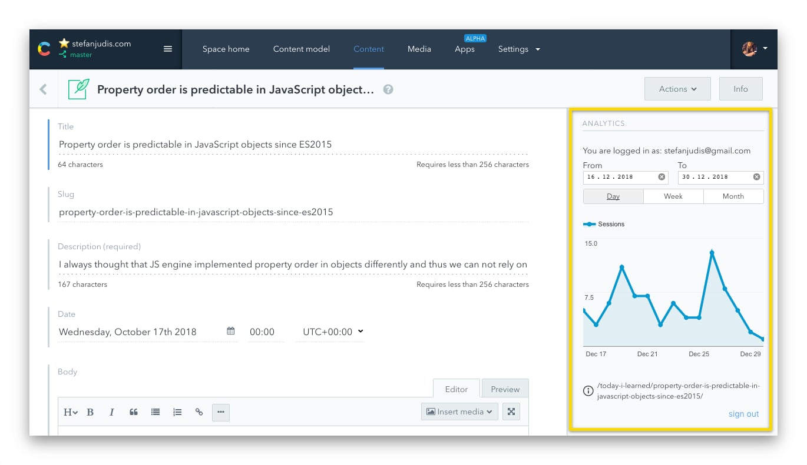

# Contentful Analytics UI-extension

> Access Google Analytics data right in Contentful

## Getting started

To to authorize the Google Analytics API several steps are needed. Head to the [./SETUP.md](SETUP.md) for all the instructions. :)

## Functionality

// TODO add netlify explanation

## Features

- [x] Log into Google Analytics
- [x] Select date range
- [x] Select day/week/month dimension
- [ ] Make more metrics accessible
- [ ] Store last settings in LocalStorage

## Licence

MIT
