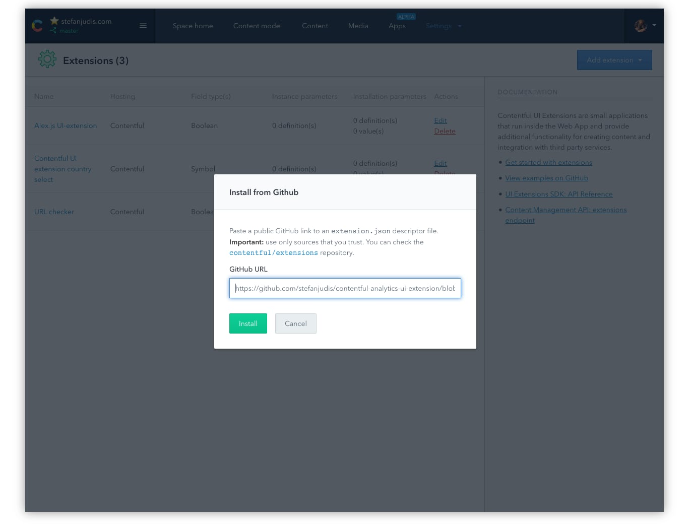
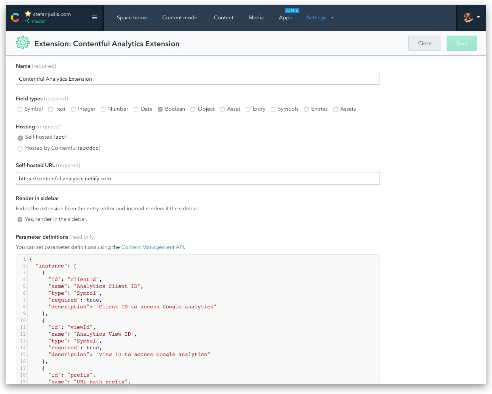
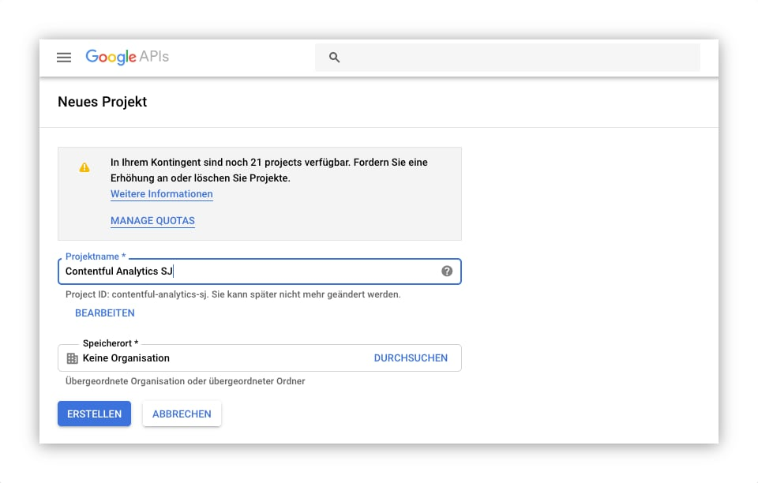
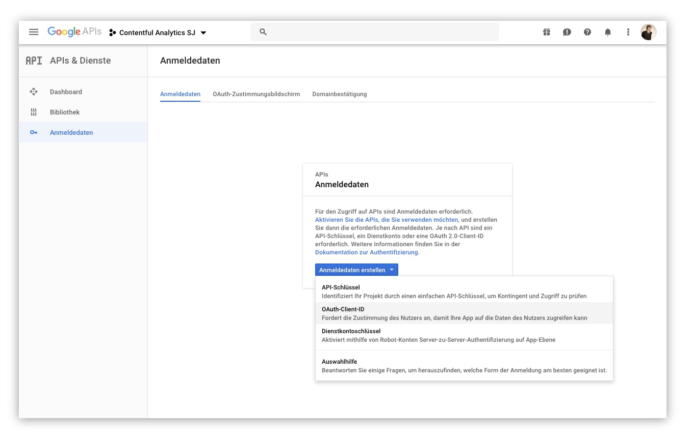
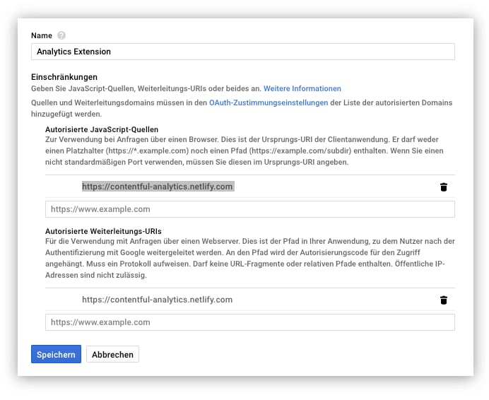
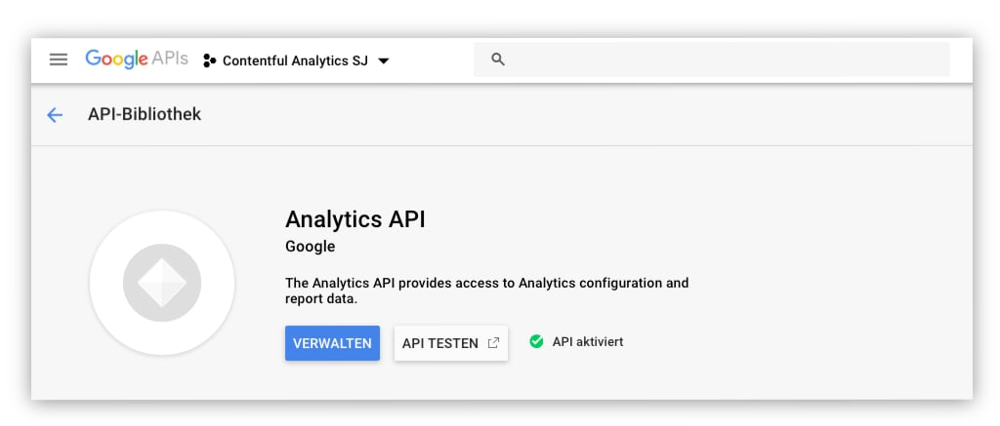
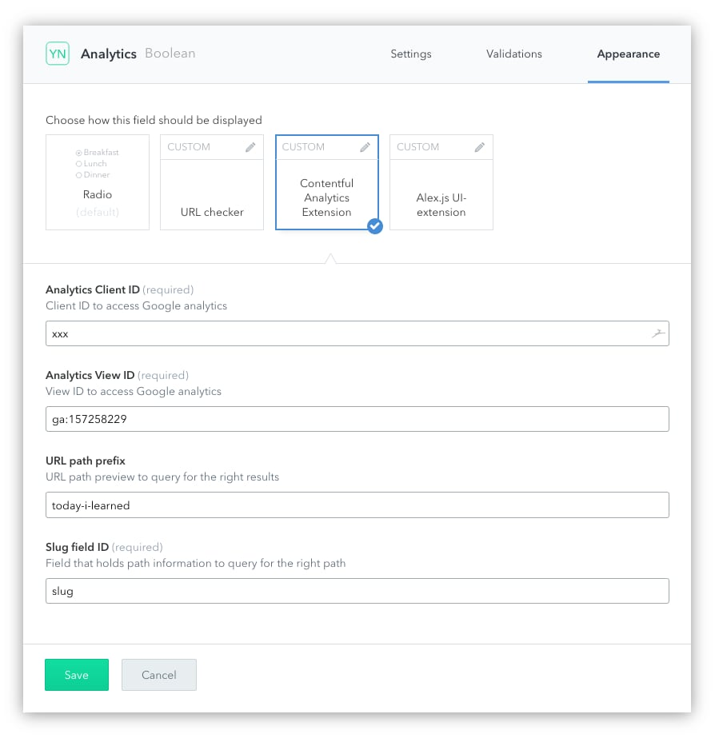

# How to set up the Google Analytics Contentful extension

To make use of Google Analytics Embed API in Contentful you have to perform two steps:

1. Install the UI-extension
2. Create new Google APIs project
3. Enable and configure Analytics API
4. Configure Analytics UI extension

## Install the UI extension

You can install a Contentful UI extension either via the CLI or with the one-click installer directly in the web app.

### Install via Web app (recommended)

Inside of the Contentful web app you can go to "Settings -> Extensions" and follow "Add extension ->
Install from Github". Paste the URL of this extension's discriptor (`https://github.com/stefanjudis/contentful-analytics-ui-extension/blob/master/extension.json`) into the dialog.

.

This process will set up the UI extension and no further action is needed at this point.

.

### Install via CLI

```
$ git clone git@github.com:stefanjudis/contentful-analytics-ui-extension.git
$ cd contentful-analytics-ui-extension
$ npm i
$ npm run create -- --space-id XXX
```

The `npm run create` command uses the [Contentful CLI](https://www.npmjs.com/package/contentful-cli). This approach is recommended when you want to develop this extension.

## Create new Google APIs project

To use the Analytics Embed API you have to create a new application in [the Google API Console](https://console.developers.google.com/project).

Click "Create Project" (if you don't have a project yet) and give the project a name.

.

Create new OAuth Client credentials for this Project.



The UI extension runs in an iframe and to make the OAuth work you have to authorize the source of the application which is `https://contentful-analytics.netlify.com`.



**Copy and paste the client ID because you'll need it to configure the UI extension in Contentful.**

## Enable and configure Analytics API

Head over the [the Library explorer](https://console.developers.google.com/apis/library?q=analytics%20api) and enable the `Analytics API`.



The Analytics API will allow access via the project wide OAuth client.

## Configure Analytics UI extension

Go to the content type in Contentful that should include Analytics API data. Create a new `Boolean` field (UI extensions have to be tied to a field). Set the appearance to be `Contentful Analytics Extension`.

This configuration parameters for the extension are as follows.

- Analytics client ID – thats the ID of the OAuth application you just created
- Analytics view ID - the view ID which you can get in Google Analytics
- URL path prefix - currently it's not possible to access preview URLs in Contentful. For my use-case a path prefix does the job to e.g. create a preview URL like `stefanjudis.com/today-i-learned/something`
- Slug Field ID – the field that will be used for URL generation in your application


